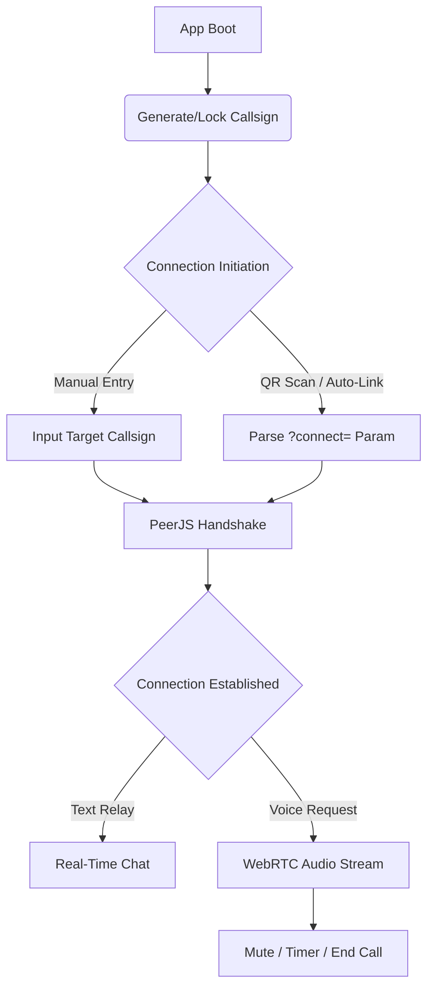

<h1 align="center">WARZONE P2P</h1>
<h3 align="center">Zero-Server Tactical Comms Terminal</h3>

<p align="center">
  A lightweight, serverless peer-to-peer communication tool built for direct, frictionless linking. Exchange callsigns or scan QR codes to establish instant WebRTC text and voice channels. No accounts, no logs, no central server.
</p>

<p align="center">
  
  
  
  
</p>

---

## The Mission: Frictionless Comms

Standard communication platforms rely on central servers, account creation, and data logging. This creates friction and compromises privacy. 

WARZONE P2P acts as a direct tactical relay. By leveraging WebRTC via PeerJS, the application establishes a direct browser-to-browser connection. Users generate a temporary "Callsign," share it via a QR code or manual entry, and instantly spawn a secure text and voice channel. Once the session ends, the link is severed.

---

## Tactical Features & Engineering Decisions

* **Callsign Identity Protocol:** 
  The app generates a unique 9-character alphanumeric callsign (e.g., `A2B-C4D-E5F`). To prevent collision fatigue, ambiguous characters (like `0` and `O`, `1` and `I`) are stripped from the generation pool. The callsign is locked into `localStorage`, ensuring identity persistence across page reloads without requiring a backend database.
* **QR Auto-Link Protocol:** 
  Instead of manually typing callsigns, the engine dynamically renders a QR code using a local `qrcode-generator` library. Scanning the code opens the app with a `?connect=` URL parameter. The app parses this parameter on boot and automatically initiates the handshake, bypassing the setup screen entirely.
* **Direct WebRTC Voice Channels:** 
  Built-in voice calling utilizes `navigator.mediaDevices.getUserMedia` to capture local audio and route it directly to the peer. The UI features a live call timer, a pulsing "ringing" state, an incoming call overlay, and local mute toggles.
* **Resilient State Management:** 
  The PeerJS implementation includes a custom error router. If a callsign is already in use globally, it triggers an `unavailable-id` fallback, prompting the user to generate a new identity. If the WebRTC peer disconnects, the client automatically attempts a `peer.reconnect()` before throwing a hard error.
* **Tactical CRT UI:** 
  Designed entirely with Vanilla CSS. The interface utilizes angular `clip-path` cuts instead of rounded corners, monospace typography for data readability, and a repeating linear gradient overlay to simulate a CRT scanline effect. 

---

## Connection Architecture

GitHub natively supports Mermaid.js diagrams. Below is the visual map of how WARZONE P2P establishes a direct peer connection:



---

## How to Deploy and Use

This application is 100% client-side and is deployed on Vercel. You can deploy your own instance instantly by pushing the code to a GitHub repository and importing it into Vercel.

### 1. Link Up
1. Open the deployed application.
2. Your unique **Callsign** will be generated automatically. 
3. Share your callsign by clicking **COPY**, or let the other user scan your **QR Code**.
4. Alternatively, the other user can manually enter your callsign into the "Link Up" input field and click **LINK**.

### 2. Establish Comms
1. Once linked, the chat interface will open.
2. Type messages into the bottom input bar and hit send.
3. To establish a voice channel, click the **Phone Icon** in the top right. The receiving peer will get an incoming call overlay to **Accept** or **Decline**.

### 3. Session Management
* **Mute:** Toggle audio transmission during a call using the **MUTE** button.
* **Disconnect:** Open the side menu (top left icon) and click **DISCONNECT** to sever the peer link. 
* **Reset Callsign:** If you encounter a callsign conflict, open the settings menu and click **RESET CALLSIGN** to generate a new identity.

---

## Tech Stack

* **PeerJS / WebRTC:** Core engine for peer discovery, data channeling, and direct media streaming.
* **Vanilla JavaScript:** Zero frameworks. All DOM manipulation, state management, and event handling are written in raw, optimized JS.
* **Vanilla CSS:** Custom tactical dark-mode styling with CSS variables, `clip-path` geometrics, and CRT overlays.
* **QRCode Generator:** Local generation of connection QR codes without external API calls.
```
